# Rishi's YOLO v1 implementation (including pretraining)

YOLO finetuning
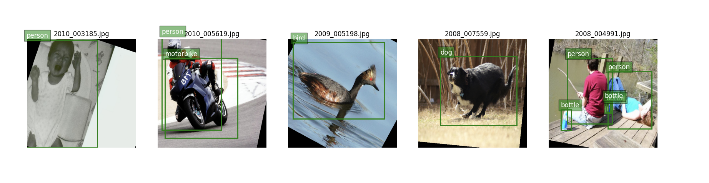

YOLO pretraining
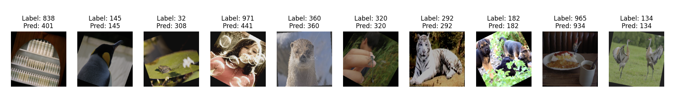

## About and results

I pretrain YOLO on ImageNet and then finetune it on Pascal VOC. The code may contain some inaccuracies but it achieves 39% correct as compared to YOLO's 65% correct.

> Note: After finishing work for this project, I realized that the YOLO guys applied NMS before calculating accuracy whereas I only applied it for visualization. As a result, there are a lot more false positives and hence, my accuracy figures below have been understated.

> Note 2: There was a bug in the code - I was training and validating on the train dataset. That's why my graphs show no overfitting. Initially, I thought that was because I was using a modest 0.5 but that's not true. Validation accuracy values shuold be overstated because of this. Training accuracy values will be the same.

> Note 3: I was using DataParallel instead of DistributedDataParallel to run training across multiple GPUs on the same machine. This is slower and more memory intensive. in my future codebases, I'll be running training with DistributedDataParallel!

### Pretraining YOLO

The YOLO network used 22.4M parameters and trained on 1 RTX 4090 image net for <5 hours (i think). I achieved 79.5% classification top-5 accuracy.

YOLO pretraining overview curves:
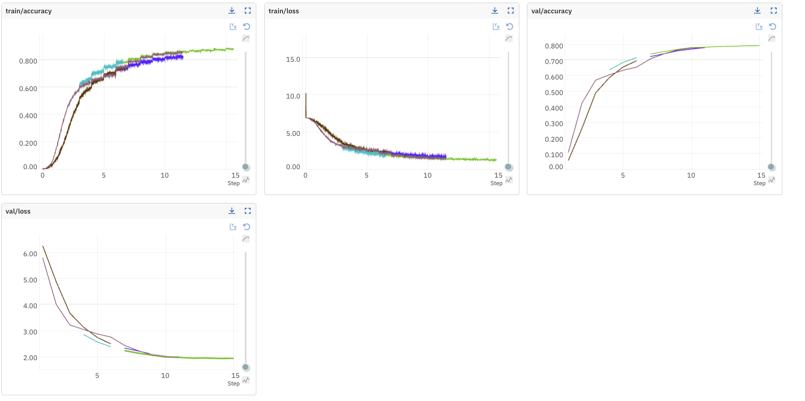

### Finetuning YOLO

The YOLO network used 272M parameters and trained on two RTX 4090s for <2 days. I trained my model for 740 epochs and achieved 39% test set accuracy. The YOLO folks trained their model for 135 epochs and achieved 65% accuracy.

YOLO finetuning overview curves:
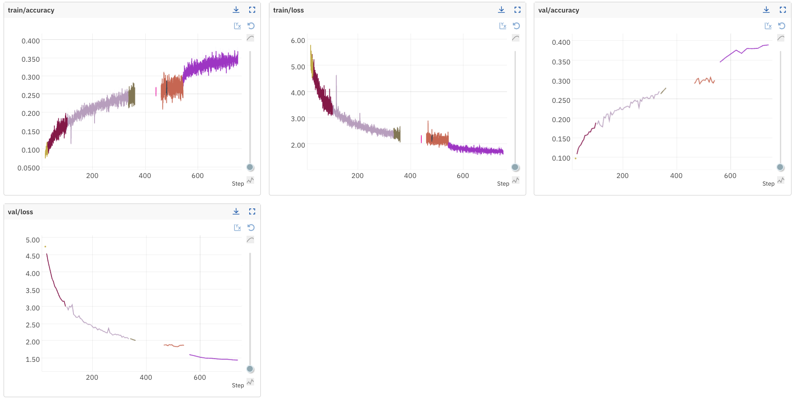

### Potential improvements

The YOLO guys pretrained their model on ImageNet until they hit 88% top-5 accuracy. I only pretrained it until 79.5% top-5 accuracy. With more hyperparameter search, I could have gotten there.

However, when finetuning YOLO, the YOLO guys hit 65% accuracy with 135 epochs whereas I only hit 39% after 740 epochs of training. Part of this was because my pretrained model wasn't as good as theirs; however, more importantly, my YOLO loss function didn't normalize by the number of objects. I tried slowly increasing the learning rate from 0.0001 to 0.001 but then the losses exploded. By the time I realized this, I had a model that was slowly improving and I was exhausted with all the coding, so I didn't fix what wasn't broken. However, if i had divided my loss by say #images in batch and #objects in image and cranked up my learning rate to 0.001, the network could have trained faster and better.

## Installing and running this project

Install requirements with

```
pip install -r requirements.txt
pip install -r requirements-dev.txt
```

Create a `config.yaml` file under `scripts` with 

```
image_net_data_dir: <path to image net dir>. # (This folder should contain the files/folders (ILSVRC2012_devkit_t12.tar.gz, ILSVRC2012_img_train.tar
pascal_voc_root_dir: <path to directory storing pascal voc dataset>. # (This folder should contain the files/folders VOCdevkit, VOCtrainval_11-May-2012.tar
```

YOLO pretraining inference:

Download the checkpoint from [here](https://drive.google.com/file/d/1tlUXxBP7nR5PrwyugNWjf3kwYwBEkmjn/view?usp=drive_link) and place it at `scripts/checkpoints/IM-122/epoch_14.pth`. Weird location? I know. Then run the command below:

```
python visualize_image_net.py --checkpoint_signature=IM-122:checkpoints/epoch_14
```

YOLO Inference:
Download the checkpoint from [here](https://drive.google.com/file/d/1g9CWFUSGlNvo6ig5U3dRiWYJVAuXl20O/view?usp=sharing) and place it at `scripts/checkpoints/IM-272/epoch_740.pth`.

```
python visualize_pascal_voc.py --checkpoint_signature IM-272:checkpoints/epoch_740 --threshold 0.25 --seed 10022 --show_preds true --apply_nms true --nms_iou_threshold 0.5
```

Pretraining:

```
python pretrain_yolo.py --num_epochs 10 --batch_size 4 --lr_scheduler custom --lr 0.001 --dropout 0 --run_name cpu_run_on_image_net
```

Finetuning:

```
python train_yolo.py --num_epochs 10 --batch_size 512 --lr_scheduler fixed --lr 0.001 --dropout 0 --run_name yolo_finetune --continue_from_image_net_checkpoint_signature IM-122:checkpoints/epoch_14
```

or

```
python train_yolo.py --run_name cont_yolo_with_data_augmentation_0.0001_with_8_threads --continue_from_yolo_checkpoint_signature IM-249:checkpoints/epoch_25 --num_epochs 135 --batch_size 64 --lr_scheduler fixed --lr 0.0001 --dropout 0.5 --device cuda --checkpoint_interval 5
```

Testing:

```
cd tests
pytest
```

### More YOLO predictions

YOLO finetuning:
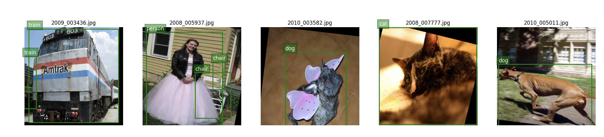
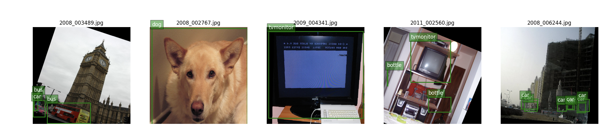

YOLO pretraining:
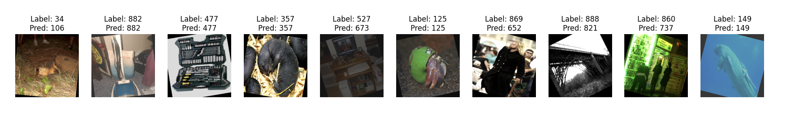
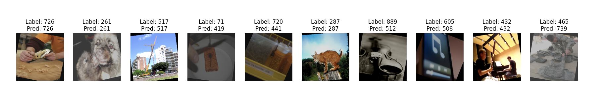

### All YOLO finetuning training curves

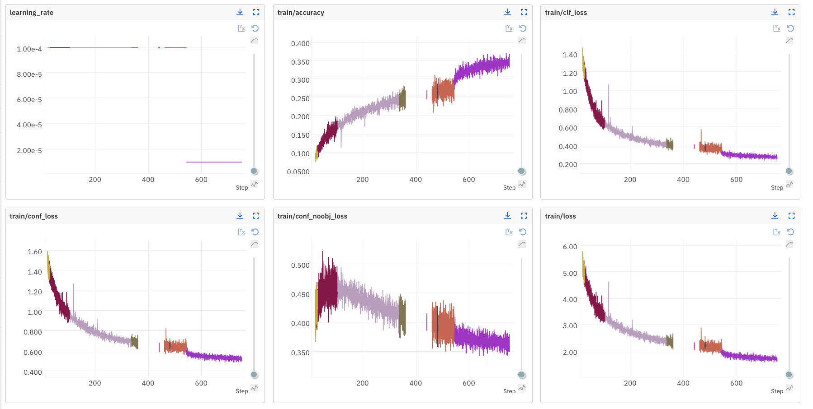
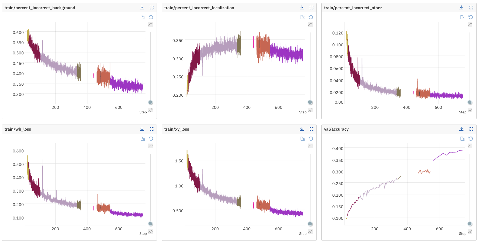
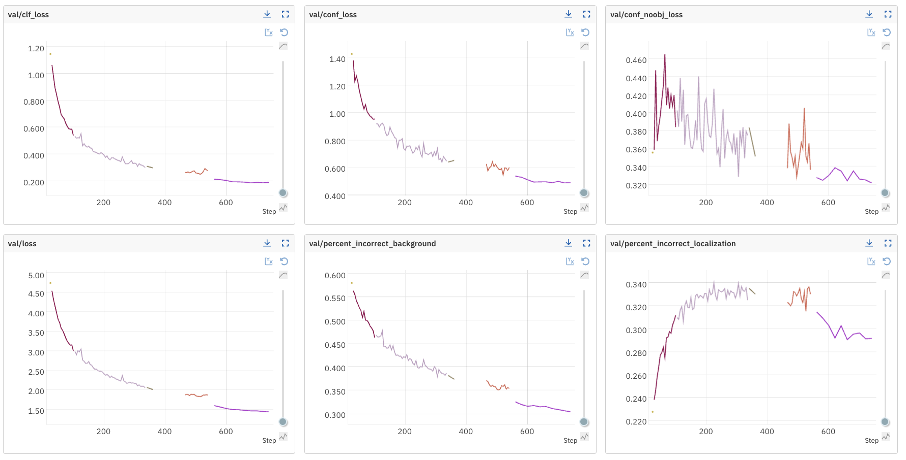
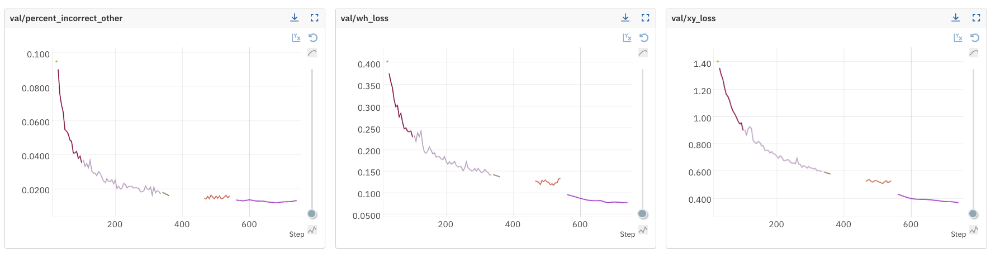

## Credits

Thanks to [neptune.ai](https://neptune.ai) for letting me use their experiment tracking tool for free. I would highly recommend it.

## References

[YOLO v1 paper](https://arxiv.org/pdf/1506.02640)
